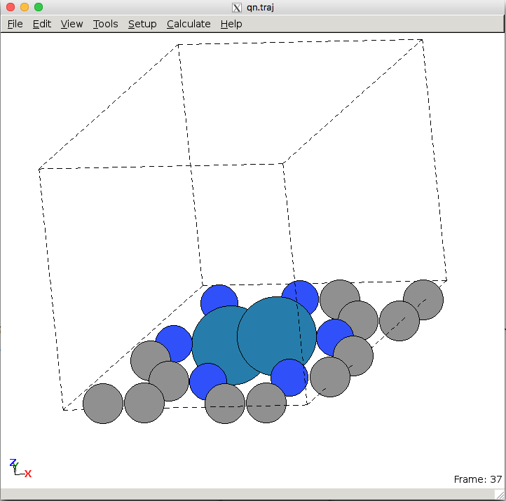
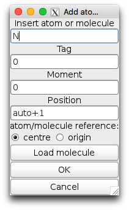
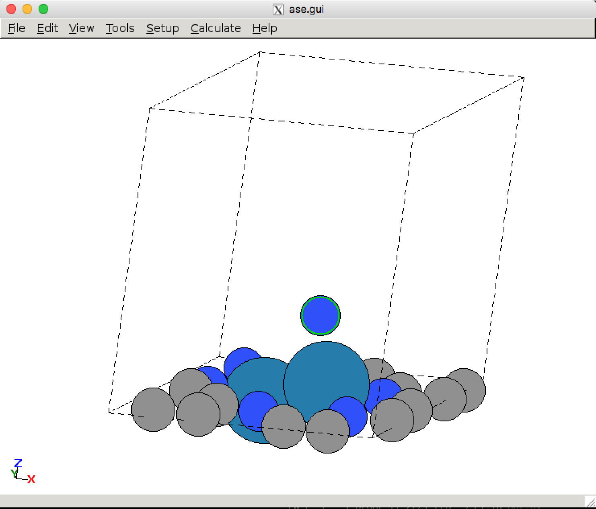
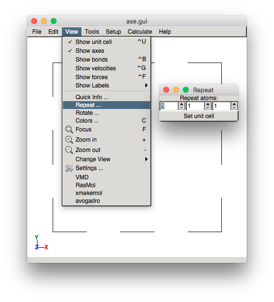

## Introduction to ASE

## Contents
1. [Atomic Simulation Environment (ASE)](#backgroun)
2. [Graphical User Interface (`ase-gui`)](#ase-gui)
3. [A Typical ASE Script](#a-typical-ase-script)

<a name='background'></a>

### Atomic Simulation Environment (ASE) ###
Currently, most of us at [SUNCAT](http://suncat.slac.stanford.edu) use the [Quantum ESPRESSO](http://www.quantum-espresso.org) calculator as implemented in the Atomic Simulation Envrionment (ASE) for density functional theory (DFT) calculations. ASE provides Python modules for manipulating atoms, performing calculations, and analyzing and visualizing the results. ASE scripts are simply regular Python scripts that incorporate the ASE modules. For detailed documentation, refer to the official [ASE websites](http://wiki.fysik.dtu.dk/ase/index.html). We will be demonstrating all the features you will need to use on the project website, but you may want to explore additional functionality on your own.

Here is an example of a few commonly used modules for a calculation and how you would use them in your Python scripts:

```python
from ase import Atoms
from ase.constraints import FixAtoms
from ase import optimize
from espresso import espresso
import numpy as np
```

The modules provide functions that can be used for setting up the system and performing calculations. The `ase.optimize` module is needed for performing geometry optimizations, the `espresso` module is needed to use the Quantum ESPRESSO calculator, and the `numpy` module is needed for using certain mathematical functions.

Typically, the script will first read a trajectory file (`.traj`) that contains the structure, then set up the Quantum ESPRESSO calculator, and then perform the calculation (often a structural optimization). You can use the ASE graphical user interface `ase-gui` to view trajectory files or to setup or modify structures. To visualize a trajectory file, simply type:

```bash
ase-gui <trajectory_file>.traj
```

ASE supports a variety of file formats. More information about ASE can be found in the [official documentation](http://wiki.fysik.dtu.dk/ase/ase/ase.html).

<a name='ase-gui'></a>

### Graphical User Interface (`ase-gui`) ###

As mentioned above, you can use the graphical user interface to view atomic structures. It is also convenient for adding or manipulating atoms inside your system. Read all the details [here](http://wiki.fysik.dtu.dk/ase/ase/gui/gui.html).

Download an example and take a look:

```bash
wget http://brohr.github.io/ASE/example.traj
ase-gui example.traj
```


You should see the following window:

<center><br>
ASE GUI interface
</center>

To add an atom, select an existing atom and go to `Edit > Add atoms` or press `Ctrl+A`. You should then see the following window pop up:

<center><br>
Adding an atom
</center>

After selecting OK, the atom will be placed on top of the atom you selected. If you did not select an atom, the new atom will be centered in the unit cell. If you want to move the atom, you can use `Tools > Move atoms` or `Ctrl+M`. The atom should have a green outline and you can use your arrow keys to move its position. You can simply hold down `Ctrl` to select multiple atoms.

<center><br>
Moving an atom
</center>

For the extended surfaces you can repeat the unit cell. This is convenient for identifying symmetric sites, which might not be obvious at first glance from the unit cell. To do this:

<center><br>
Repeating a slab
</center>

<a name='a-typical-ase-script'></a>

### A Typical ASE Script ###

ASE scripts can be run directly in the terminal (in the login node) or submitting to external nodes. Generally, you will be submitting jobs to external nodes and only small scripts will be run on the login node. By default, all output from any submitted script will be written *from the directory where the submission command was executed*, so make sure you are inside the calculation folder before running the submission command.

You can see the script by typing the following command

```bash
vi opt.py
```

Let's walk through the script. The first line,

```python
#!/usr/bin/env /home/vossj/suncat/bin/python
```

will ensure that the version of Python that is being used is the one that has all the software from SUNCAT installed.

Next, notice the comments in the beginning. These lines will be ignored by Python, but will be read by the job submission system. These include information such as how much time to allocate, the number of nodes required, what the names of the output and error files are, what the name of the job should be, and what your email is. Most of the settings will be the same regardless of the job you submit. You will mostly just be changing the amount of allocated time and the number of nodes, for jobs that require parallelization (not required for this project).

```python
#above line selects special python interpreter needed to run espresso
#SBATCH -p iric
#################
#set a job name
#you can also use --job-name=$PWD when submitting
#SBATCH --job-name=myjob
#################
#a file for job output, you can check job progress
#SBATCH --output=myjob.out
#################
# a file for errors from the job
#SBATCH --error=myjob.err
#################
#time you think you need; default is 20 hours
#SBATCH --time=48:00:00
#################
#number of nodes you are requesting
#SBATCH --nodes=1
#################
#SBATCH --mem-per-cpu=4000
#################
#get emailed about job BEGIN, END, and FAIL
#SBATCH --mail-type=ALL
#################
#who to send email to; please change to your email
#SBATCH  --mail-user=YOUR_SUNETID@stanford.edu
#################
#task to run per node; each node has 16 cores
#SBATCH --ntasks-per-node=16
```

To change the allocated time for the jobs, modify (MM:SS):

```python
#SBATCH --time=1200:00
```

Next, we import all the relevant ASE modules in for this calculation

```python
from ase import *
from ase.lattice.surface import *
from ase.optimize import *
from ase.constraints import *
from espresso import espresso
```

The asterisks `*` indicates that all methods and classes should be imported. You can also specify the ones you need. `from ase import *` imports all the basic functionality in ase, `from ase.lattice.surface import *` import methods and classes related to solid surfaces, `from ase.optimize import *` imports the optimization methods, `from ase.constraints import *` imports the constraint methods, and most importantly `from espresso import espresso` import the Quantum ESPRESSO calculator for the ASE interface.

We read in a .traj file, which specifies the location of the nuclei and unit cell boundaries.

```python
try:
    atoms = read('qn.traj')
except:
    try:
        atoms = read('qn.traj.bak')
  os.system('cp qn.traj.bak qn.traj')
    except:
        atoms = read('init.traj')
        atoms.rattle(stdev=0.01)
```
which we can easily modify and use for naming output files.

Then, the Quantum ESPRESSO calculator is set up. All parameters related to the electronic structure calculation are included here. The following example shows typical parameters that we use in the group for metal calculations. Typically, the number of k-points is determined using 24 Å per lattice vector for transition metals.

```python
#espresso calculator setup
calc = espresso(pw=600,             #plane-wave cutoff
                dw=6000,        #density cutoff
                xc='BEEF',    #exchange-correlation functional
                kpts=(6,6,1),       #k-point sampling;
                nbands=-60,         #20 extra bands besides the bands needed to hold
                          #the valence electrons
                smearing='gaussian',
                sigma=0.1,
                convergence= {'energy':1e-5,
                         'mixing':0.1,
                         'nmix':10,
                         'mix':4,
                         'maxsteps':500,
                         'diag':'david',
                                   'mixing_mode':'local-TF'
                          },  #convergence parameters
                dipole={'status':True}, #dipole correction to account for periodicity in z
                spinpol=False,
                outdir='calcdir',
                output = {'removesave':True},
                psppath = '/scratch/users/aayush/psp/gbrv/')  #new vanderbilt psp's
```


Finally, the Quantum ESPRESSO calculator is attached to the `slab` Atoms object, and the optimizer is defined.

```python
atoms.set_calculator(calc)
```

To perform structural optimizations, an optimizer needs to be defined. We will be using the BFGS Line Search, which is implemented in `QuasiNewton`. For more details about optimizations in ASE, look at [this page](https://wiki.fysik.dtu.dk/ase/ase/optimize.html). `QuasiNewton()` is an object for the [structural optimization](https://wiki.fysik.dtu.dk/ase/ase/optimize.html), which takes an Atoms object as an input. A convergence criteria is set and `qn.run()` initiates the optimization.

```python
qn = QuasiNewton(atoms, trajectory='qn.traj', logfile='qn.log')
qn.run(fmax=0.05)                              #until max force<=0.05 eV/AA
```

The `logfile=` argument is optional. If it's not specified, then the output will be written to the system output, e.g. `myjob.out`. If it is specified, then the output for the optimization will be written to `name+'.log'`, e.g. `Pt111.log`. You should see the following results:

```bash
BFGSLineSearch:   0[  0]  12:50:46   -28144.460970       1.7496
BFGSLineSearch:   1[  1]  12:59:45   -28145.528706       0.4792
BFGSLineSearch:   2[  2]  13:07:35   -28145.571393       0.3625
BFGSLineSearch:   3[  3]  13:14:49   -28145.600615       0.1408
BFGSLineSearch:   4[  4]  13:21:30   -28145.608312       0.0994
BFGSLineSearch:   5[  5]  13:27:02   -28145.610934       0.0540
BFGSLineSearch:   6[  6]  13:31:28   -28145.611948       0.0245
```

The column names for the results are:

```bash
optimizer         step    time       total energy (eV)   forces (eV/Å)
```

The final energy output is also stored in a file called `out.energy`. You can see its contents by typing the bash command:

```bash
cat out.energy
```

The trajectory for all optimization steps are stored in `'qn.traj'`. You can read the output trajectory using `ase-gui qn.traj` and view all steps. The final energy is also stored in the `.traj` file and can be retrieved by reading in the `.traj` file. Using Python in interactive mode (i.e., by running `python`):

```python
>>> from ase.io import read
>>> atoms = read('output.traj')
>>> atoms.get_potential_energy()
-28436.147150825487
```
