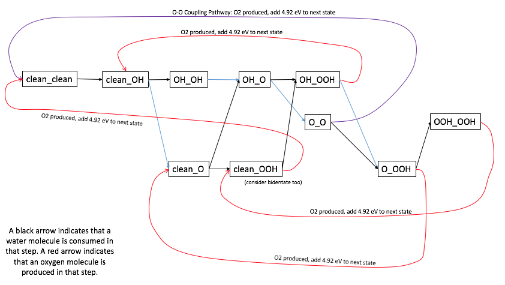
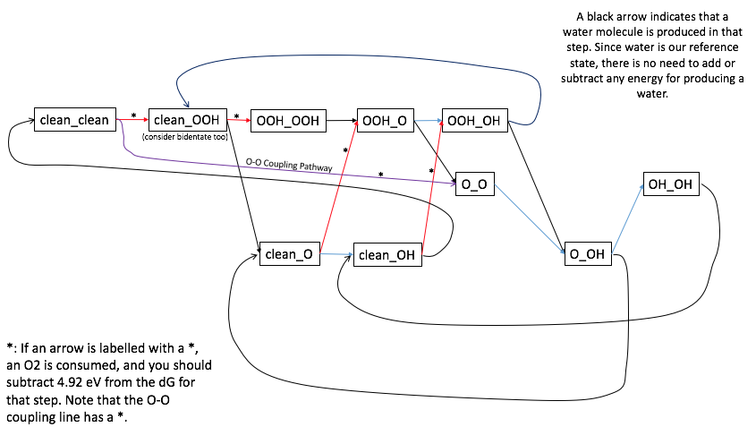

1. [Free Energy Corrections](#entropy)
2. [Free Energy Diagram and Overpotential Analysis](#analysis)
3. [Report](#report)

## Free Energy Corrections ##

The binding energies that you have calculated are electronic binding energies. They do not incluide zero point energy, heat capacity, or entropy. The electronic energy is a useful physical quantity, but we are also interested in binding free energies. We can convert electronic energies to free energies by adding the following corrections. Note that the corrections are only valid at 1 bar H2 and the vapor pressure of water at room temperature.

Free energy correction for O: +0.07 eV
Free energy correction for H: +0.3 eV

For every adsorbed species, add the above correction to the electronic energy. For example, OOH's binding energy should be increased by 2 * 0.07 + 0.3 eV. Assume that the O-O coupling transition-state is adsorbed and behaves just like O2. Its energy should therefore be increased by 2 * 0.07 eV.

## Free Energy Diagram And Overpotential Analysis ##

## OER ##

We will begin by creating a free energy diagram at 0V. [Here](/LimitingPotentialToyExample.xlsx) is an example of a toy free energy diagram. If you change the voltage to 0V, you can see what a normal free energy diagram looks like.

At each step in OER, there reaction may only proceed in one of two ways. They are 1) addition of an OH (really the adsorption of a water molecule with one H splitting into a proton, which is released into solution, and an electron, which flows into the anode), or 2) the desorption of an adsorbed hydrogen (really the splitting of an adsorbed hydrogen into a proton, which is released into solution, and an electron, which flows into the anode).

On the monomer:
 The monomer is quite easy to analyze because there is only one possibility at each step. The reaction must procede through the following pathway:
 1) clean (this state really has two waters above it. Since the clean catalyst with water is our reference, we can call this state 0 eV)
 2) adsorption energy of OH* (with respect to H2O and H2, meaning the free energies of adsorption that you have calculated)
 3) adsorption energy of O* (with respect to H2O and H2, meaning the free energies of adsorption that you have calculated)
 4) adsorption energy of OOH* (with respect to H2O and H2, meaning the free energies of adsorption that you have calculated)
 5) clean (this state has an O2 gas molecule above it. Since O2 gas is 4.92 eV uphill from water and hydrogen, our reference, you need to add 4.92 eV to this energy)

On the dimer (both the close and the far configurations):
Again, start with the clean catalyst. Again, we can call this 0 eV.

The first step must be the addition of OH* (going to clean_OH)
The second step has two possibilities: a) addition of OH to the other metal (going to OH_OH) or b) the removal of a hydrogen (going to clean_O). You should choose the one that is more stable (more downhill in free energy) for your catalyst.

Work your way through the mechanism, choosing the lowest energy option at each step. You should use the free energies of adsorption that you have calculated to determine which is the lowest energy option. The flowchart below should help guide your thinking. Eventually (in fewer than 7 steps), you should arrive at an intermediate that you've already seen. At this point, you have found your catalyst's OER loop. For now, assume that the process does not proceed through the O-O coupling pathway. Your electrochemical loop should contain exactly four arrows (corresponding to four steps), two of which should be colored black indicating the consumption of a water molecule, and one of which should be colored red indicating the production of an O2 molecule.

For both your monomer and dimer configurations, plot the free energy diagram for the cyclic process at 0V in the style of the toy example shown above. Identify the most uphill step in your process. Subtracting the energy difference for an ideal step (1.23 eV) from the energy difference of your most uphill step gives you the limiting potential for your process, u_lim. This is the potential beyond which all steps in your cycle are downhill. The best known OER catalysts have a overpotential on the order of 0.3 V.  

So far we have determined the mechanism using solely the thermodynamics of the reaction steps. This is a reasonable assumption when comparing only electrochemical proton/electron transfer steps, which are likely to have similar barriers for a given step energy. When comparing electrochemical steps to the thermochemical O-O coupling step, however, we must have the barriers. In Project Part 3, you calculated the O-O coupling barrier for the close and far dimer configurations. Electrochemical transition states are considerably more expensive to calculate, and so you may use the following equation to calculate the electrochemical barrier a given step, where u is the applied potential relative to the limiting potential the given step. 

dG_a = 0.7 - 0.5*u

The O-O coupling step has a chance to be relevant for your catalyst IFF you find the O_O state as part of your OER electrochemical loop. If this is the case, compare your calculated O-O coupling barrier to the potential-dependent expression for dG_a above. Since dG_a decreases as the applied potential becomes more positive, the chances of O-O coupling being the preferred pathway increase as you decrease u. On your close and far dimer catalysts, identify the most positive potential u_crit for which O-O coupling is the dominant mechanism. You should be able to identify a new loop on the flowchart above that now contains the O-O coupling step. Next, try to find the least positive applied potential (lowest possible overpotential) u_best for which O-O coupling is the preferred mechanism AND all electrochemical steps of your new OER loop are downhill. If this is possible and u_best < u_lim, the O-O coupling mechanism has reduced your overpotential! Plot the free energy diagram of your new OER loop for your close and far catalysts at an applied potential of u_best.

## ORR ##

We will begin by creating a free energy diagram at 0V. [Here](/LimitingPotentialToyExample.xlsx) is an example of a toy free energy diagram. If you change the voltage to 0V, you can see what a normal free energy diagram looks like.

At each step in ORR, the reaction may only proceed in one of three ways. They are 1) removal of an OH (really the combination of a proton from solution and an electron from the surface onto an OH on the surface, leading to the desorption of a water molecule), 2) the adsorption of a hydrogen onto an O atom on the surface (really the combination of a proton from solution and an electron from the surface to form adsorbed hydrogen), or 3) the concerted adsorption of O2 and the subsequent adsorption of a hydrogen (from a proton/electron pair) onto the O2.

**There are many equivalent ways to treat the reference energies. In ORR, we think it's easiest to think about energy differences between steps. When proceeding from one step to the next, use the binding free energies that you calculated to determine the delta G for that step. For example, if a catalyst has -1.1 eV free binding energy for O_O and a -0.5 eV free binding energy for O_OH, then the delta G for the step O_O -> O_OH is +0.6 eV (-0.5 eV - -1.1 eV). Each time a clean site becomes an OOH* site, an oxygen molecule is consumed. Each time this occurs, subtract 4.92 eV from the delta G for the step. You should also subtract 4.92 eV from the O-O dissociation step for the same reason.**

On the monomer:
 The monomer is quite easy to analyze because there is only one possibility at each step. The reaction must procede through the following pathway:
 1) clean. (choose this to be 0 eV)
 2) OOH* . (Note that the full reaction for the step 1->2 is really clean + O2(g) + proton + electron -> OOH* ). The energy for this state is given by the following equation: [Energy of the previous state, which was 0 eV] + [Free binding energy of OOH*] - [Free binding energy of the clean catalyst, which is 0 eV] - 4.92 eV (for the consumption of O2).
 3) O* . (Note that the full reaction for the step 2->3 is really OOH* + proton + electron -> O* + H2O). The energy for this state is given by the following equation: [Energy of the previous state] + [Free binding energy of O*] - [Free binding energy of OOH*].
 4) OH* . (Note that the full reaction for the step 3->4 is really O* + proton + electron -> OH* ). The energy for this state is given by the following equation: [Energy of the previous state] + [Free binding energy of OH*] - [Free binding energy of O* ].
 5) clean. (Note that the full reaction for the step 4->5 is really OH* + proton + electron -> H2O + clean). The energy for this state is given by the following equation: [Energy of the previous state] + [Free binding energy of the clean catalyst, which is 0 eV] - [Free binding energy of OH* ].

On the dimer (both the close and the far configurations):
Again, start with the clean catalyst. Again, we can call this 0 eV.

Work your way through the mechanism, choosing the lowest energy option at each step. Use the same methodology as just described for the monomer to calculate the free energy of the (at most two) possible states at each step. The flowchart below should help guide your thinking. Eventually (in fewer than 7 steps), you should arrive at an intermediate that you've already seen. At this point, you have found your catalyst's ORR loop. For now, assume that the process does not proceed through the O-O coupling pathway. Your electrochemical loop should contain exactly four arrows (corresponding to four steps), two of which should be colored black indicating the production of a water molecule, and one of which should be colored red indicating the consumption of an O2 molecule.

For both your monomer and dimer configurations, plot the free energy diagram for the cyclic process at 0V in the style of the toy example shown above. Identify the least downhill (most uphill) step in your process. Subtracting the energy difference for your least downhill (most uphill) step from the energy of an ideal step (1.23 eV) gives you the limiting potential for your process, u_lim. This is the maximum applied potential for which all steps in your cycle are downhill. The best known ORR catalysts have a overpotential on the order of 0.3 V.  

So far we have determined the mechanism using solely the thermodynamics of the reaction steps. This is a reasonable assumption when comparing only electrochemical proton/electron transfer steps, which are likely to have similar barriers for a given step energy. When comparing electrochemical steps to the thermochemical O-O coupling step, however, we must have the barriers. In Project Part 3, you calculated the O-O coupling barrier for the close and far dimer configurations. Electrochemical transition states are considerably more expensive to calculate, and so you may use the following equation to calculate the electrochemical barrier a given step, where u is the applied potential relative to the limiting potential the given step. 

dG_a = 0.7 + 0.5*u

To consider O-O coupling, compare your calculated O-O coupling barrier to the potential-dependent expression for dG_a above. Since dG_a increases as the applied potential becomes more positive, the chances of O-O coupling being the preferred pathway increase as you increase u. On your close and far dimer catalysts, identify the least positive potential u_crit for which O-O coupling is the dominant mechanism. You should be able to identify a new loop on the flowchart above that now contains the O-O coupling step. Next, try to find the most positive applied potential (lowest possible overpotential) u_best for which O-O coupling is the preferred mechanism AND all electrochemical steps of your new ORR loop are downhill. If this is possible and u_best > u_lim, the O-O coupling mechanism has reduced your overpotential! Plot the free energy diagram of your new ORR loop for your close and far catalysts at an applied potential of u_best.

## Report ##

Your report should be between 3 to 5 pages long including figures and tables. Please be succinct and organize it in the following way:

1) Introduction (brief): Why are OER and ORR important? What are the challenges? What might be interesting about the systems that we are studying?

2) Calculation Details: Describe the DFT parameters used. Which calculations were performed and what information do they provide for us? Show a few images of catalysts and adsorbates.

3) Results and Discussion: Include a table of binding energies (electronic and/or free energies). Include free energy diagram(s) with corresponding overpotentials for each configuration. Are your overpotentials comparable to the state of the art catalysts (0.3 V)? State the mechanisms (loops) by which OER and ORR would proceed. Is O-O coupling relevant? Discuss the performance of your catalysts - if your catalyst is not ideal, is it too reactive or too unreactive? ...

4) Conclusions (brief): 5 sentence summary of your project results.

